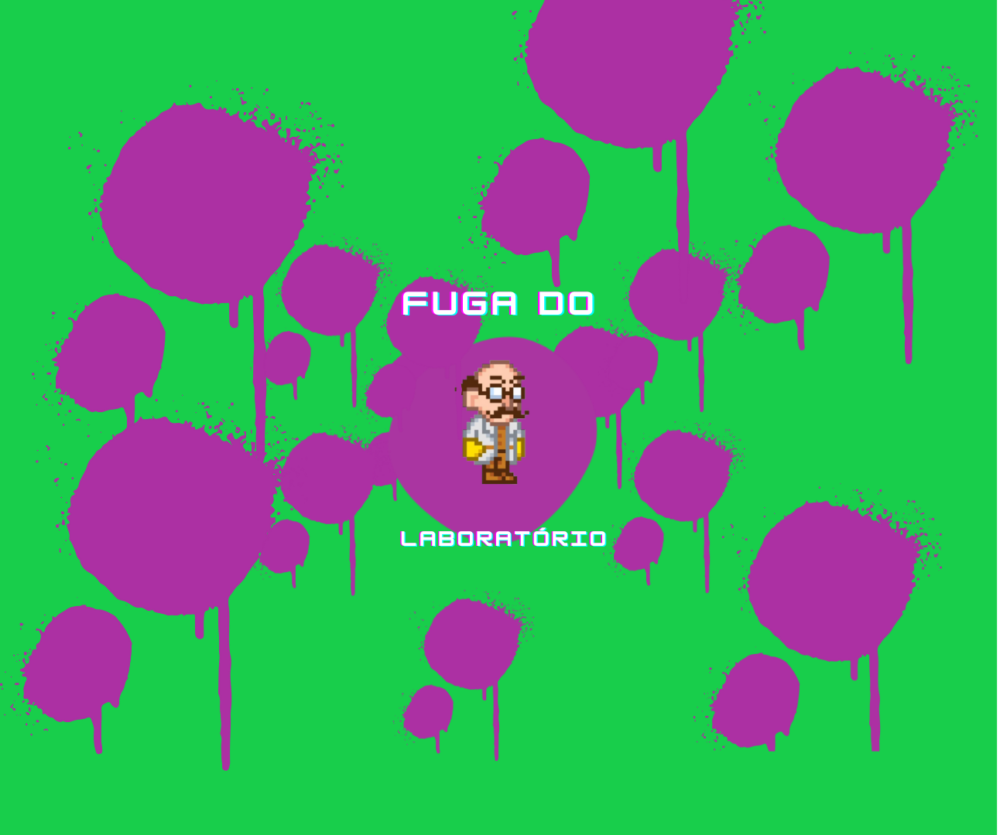
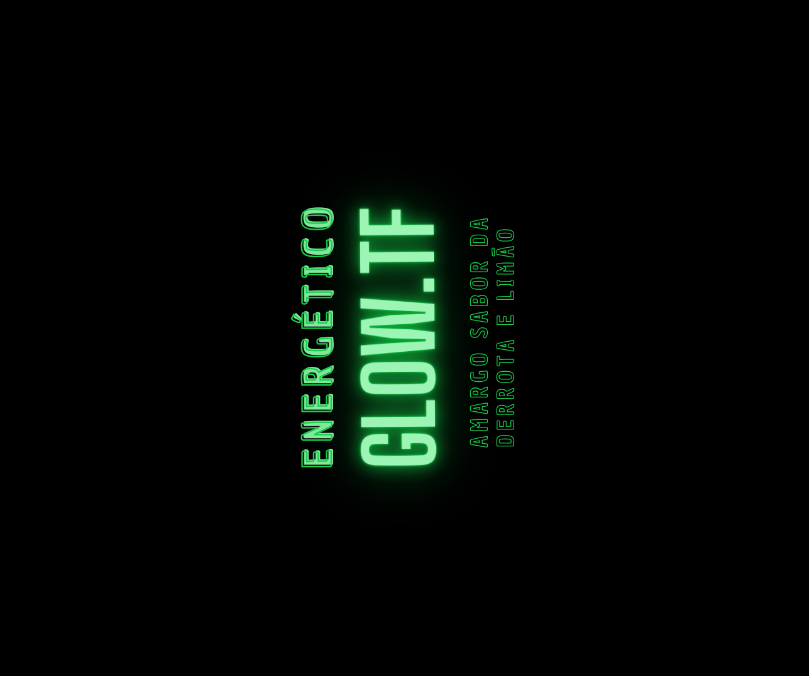
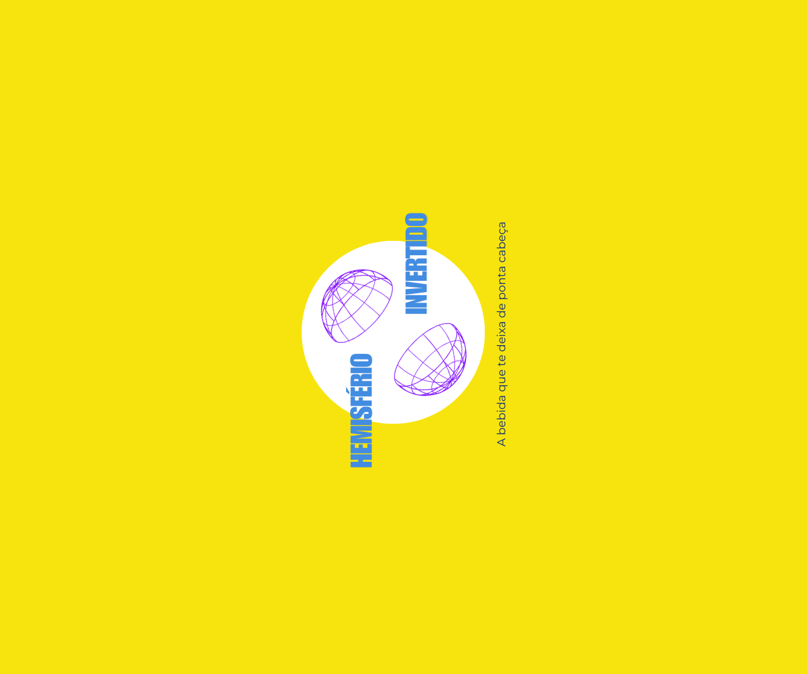
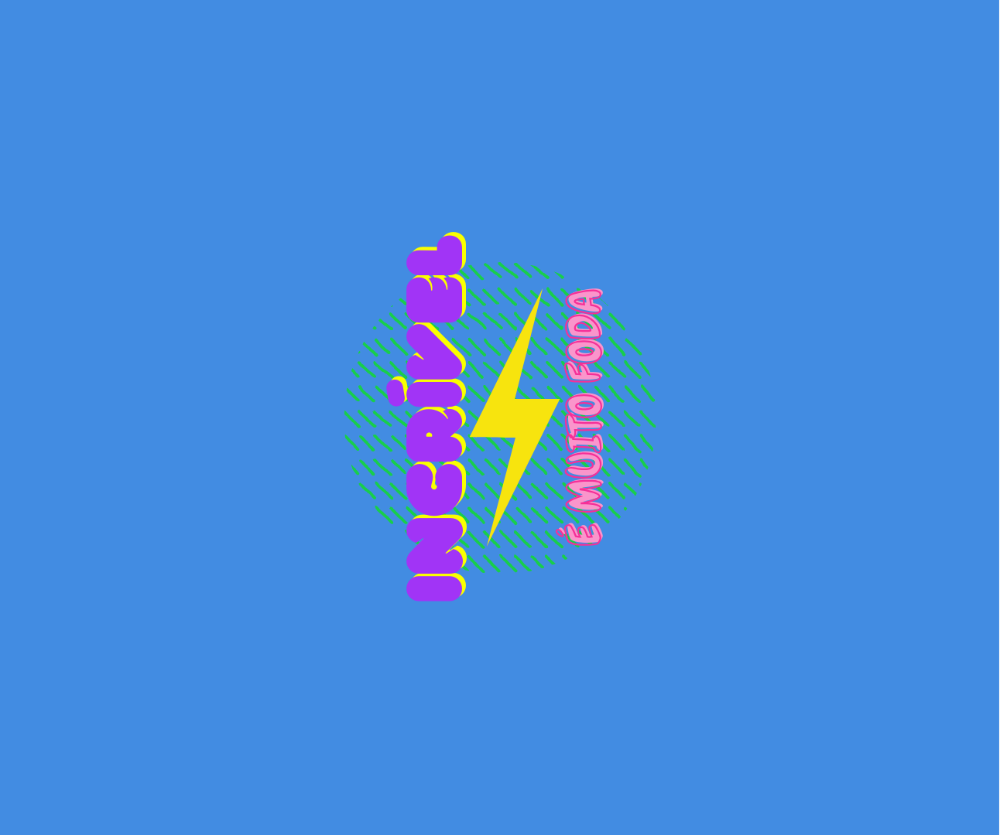
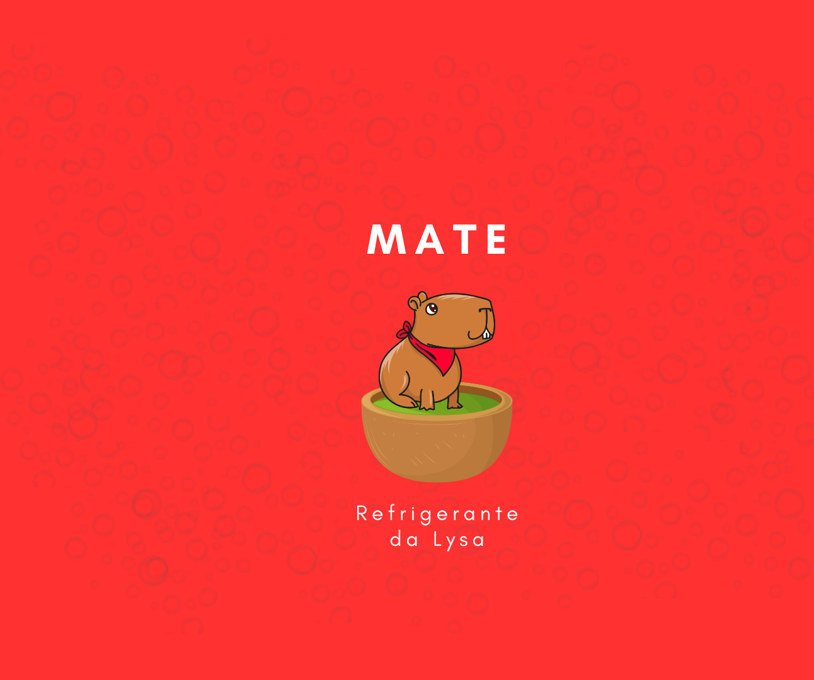
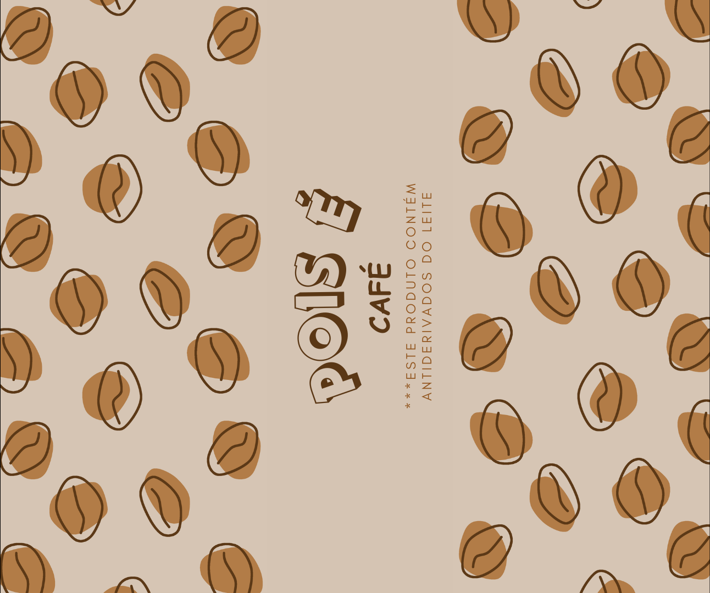
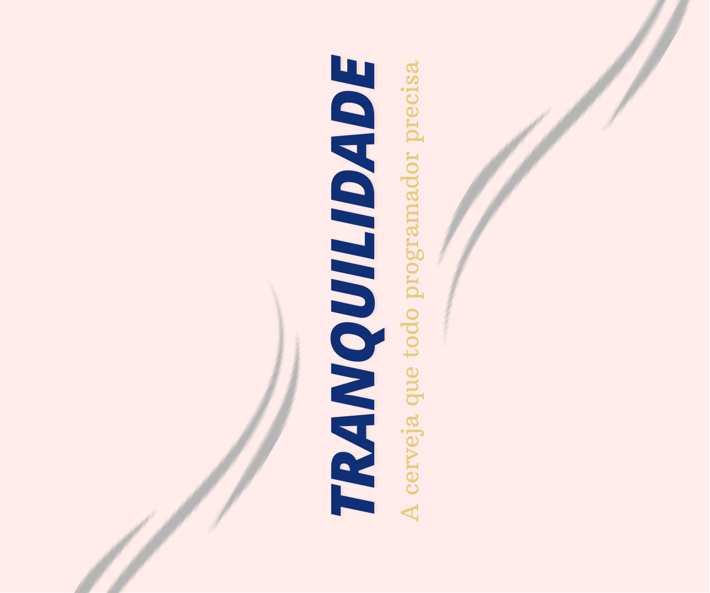
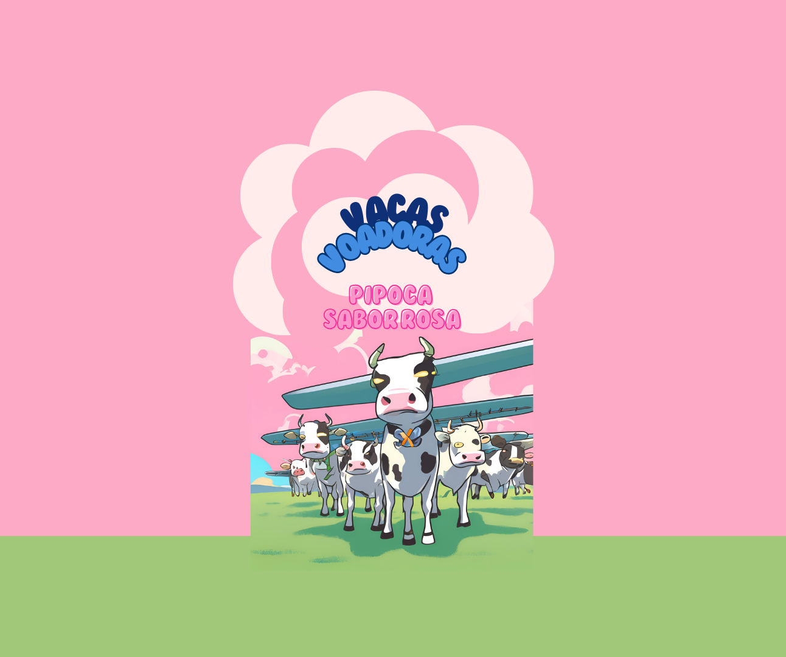

# Máquina de vendas
Nova versão da Máquina de Vendas, um clássico trabalho da disciplina de Raciocínio Algoritmico, do primeiro período de ciência da computação da PUCPR, agora feito em java, para a disciplina de Programação Orientada a Objetos.
O programa conta tanto com uma versao console, quanto a versão com a interface gráfica. A máquina de vendas aceita pagamentos tanto em cartão de crédito, quanto em dinheiro, retornando o troco.

  
  

## Produtos
Os produtos da máquina de vendas foram desenhados no [Canva](https://www.canva.com/pt_br/) e foram baseados em trabalhos passados, além de piadas internas da equipe.

Fuga do laboratório é o refrigerante roxo fluorescente do temido vilão Dr. Nefarious, do jogo da [Capivara Lysa](https://github.com/ana-borowsky/jogo_as_aventuras_de_lysa)  
  
Este energético vai dar um brilho na sua mente. Baseado no trabalho de web [Glow.tf](https://github.com/ana-borowsky/glowtf)  
  
Hemisfério Invertido é uma bebida que não matará a sua sede. Baseado em um exercício da disciplina de Modelagem de Fenômenos Físicos da Natureza.  
  
O energético incrível te deixará preparado para virar qualquer madrugada fazendo trabalhos ou estudando para as provas.  
  
Se delicie com essa saborosa bebida sabor mate, da Lysa, do jogo [As Aventuras de Lysa](https://github.com/ana-borowsky/jogo_as_aventuras_de_lysa)  
  
Nosso refrigerante matemático te fará perder as contas de quanto dinheiro já gastou para tomá-lo. Baseado no [jogo](https://github.com/ana-borowsky/mathmagik). E sim, o erro é proposital.  
  
Pois é Café é uma deliciosa bebida gelada. Não recomendada para pessoas alérgicas ou com sensibilidade a alimentos antiderivados do leite.  
  
Esse suco não sairá da sua cabeça.  
  
A cerveja que todo programador precisa.  
  
A melhor bebida sabor rosa do mercado. Atenção, pode causar efeitos psicodélicos.  
 

## Modelagem 3D
A modelagem 3D foi feita no Fusion360 e no Blender. Para criação de mais latas com facilidade, foram criados templates tanto no Blender, quanto no Krita.
  

